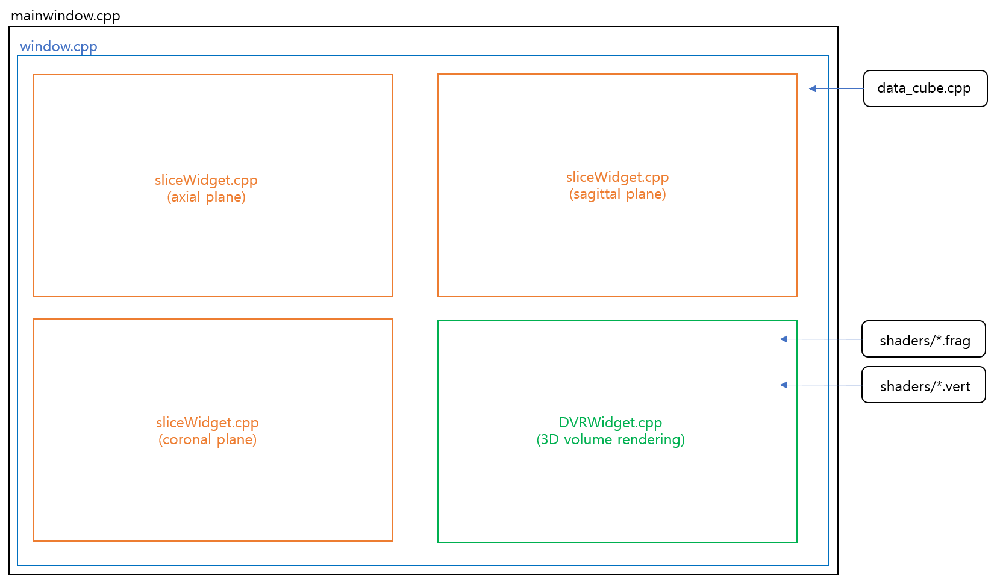
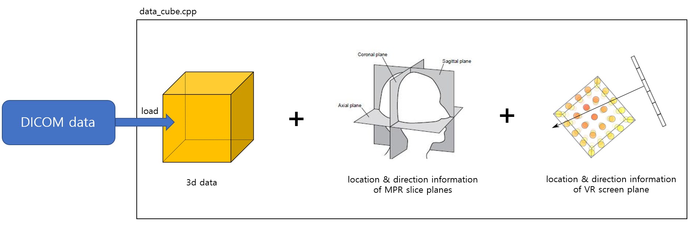
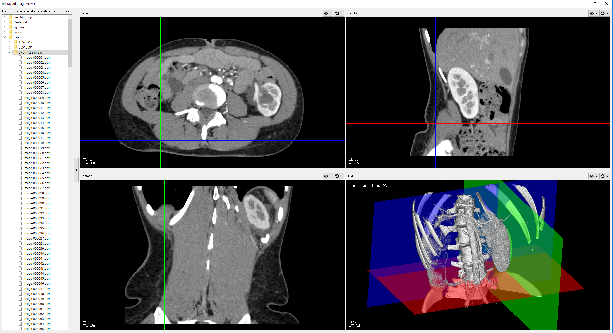

# MPR_DVR_Project

## Overall Architecture

  

  

  

## Baseline Code

> [**Hello GL2 Eample**](https://doc.qt.io/qt-5/qtopengl-hellogl2-example.html)  
> The Hello GL2 example demonstrates the basic use of the OpenGL-related classes provided with Qt.  
> code: [link](https://code.qt.io/cgit/qt/qtbase.git/tree/examples/opengl/hellogl2?h=5.14)

## Results

  

